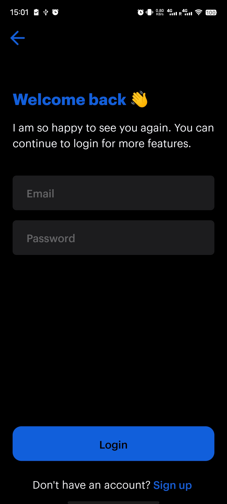

# NiuCinema
 A basic GitHub repository for learning purpose.
 
# Screenshots
# Authentication Screen

 
 

# Login Screen

 
 

# Sign Up Screen

 
 

# Movie List Screen

 
 

# Movie Details Screen

 
 

